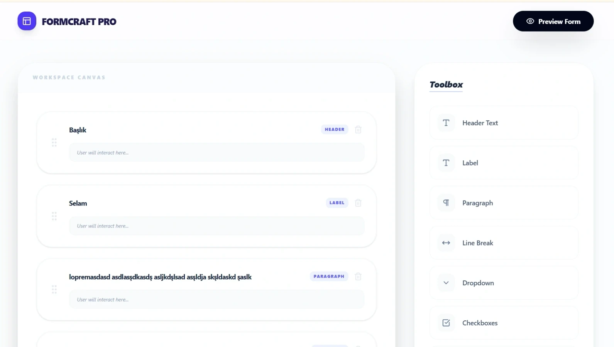
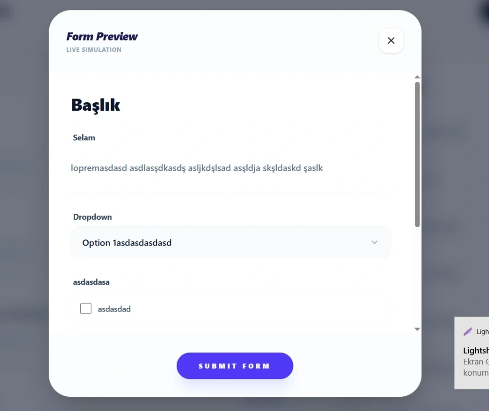

# form-builder-app

React • Vite • Tailwind CSS v4 • Lucide Icons • dnd-kit App

---

[See The Project](https://akformbuilderapp.netlify.app/)

---




---

Bu proje, **Patika.dev** Front-End Eğitim Programı "Proje 6" gereksinimlerine uygun olarak geliştirilmiş; modern sürükle-bırak (Drag and Drop) teknolojileri, Tailwind CSS v4'ün yeni nesil mimarisi ve dinamik form yönetim prensiplerini bir araya getiren profesyonel bir Form Builder uygulamasıdır. Kullanıcıların kod yazmadan saniyeler içinde kompleks formlar tasarlayabileceği, düzenleyebileceği ve önizleyebileceği SaaS odaklı bir arayüz sunar.

### 🚀 Özellikler

- **Gelişmiş Sürükle-Bırak (DND):** `@dnd-kit` kullanılarak oluşturulan toolbox-to-canvas ve canvas içi dikey sıralama (sorting) yeteneklerine sahip performanslı sürükleme motoru.
- **Dinamik Eleman Yönetimi:** Header, Text Input, Number Input, Checkboxes ve Dropdown gibi temel form bileşenlerini anlık olarak ekleme, silme ve yer değiştirme özelliği.
- **Gerçek Zamanlı Düzenleme Paneli:** Seçilen her bir bileşenin "Label" ve "Option" (seçenekler) verilerini anlık olarak güncelleyen, yan panel (sidebar) tabanlı ayar merkezi.
- **Dinamik Seçenek (Option) Yönetimi:** Checkbox ve Dropdown gibi çoktan seçmeli elemanlar için sınırsız seçenek ekleme, silme ve isimlendirme desteği.
- **Etkileşimli Önizleme Modu:** "Preview Form" özelliği ile oluşturulan formun son halini gerçek kullanıcı deneyimiyle simüle eden, interaktif modal tabanlı önizleme alanı.
- **Tailwind CSS v4 Yapısı:** En yeni CSS-first yapılandırması ile optimize edilmiş, modern renk paletleri ve cam efekti (glassmorphism) detaylarıyla zenginleştirilmiş UI.
- **Tam Responsive Tasarım:** Masaüstü düzenleme kolaylığı ile mobil cihazlarda form yapılandırma esnekliğini birleştiren, her ekran boyutuyla uyumlu yapı.

### 🛠️ Teknoloji Yığını

- **Frontend:** React (Vite)
- **Styling:** Tailwind CSS v4 (Modern & Fluid UI)
- **DND Motoru:** @dnd-kit (Core, Sortable, Utilities)
- **İkonlar:** Lucide React
- **Durum Yönetimi:** React State (Dinamik Form Schema)
- **Yardımcı Kütüphaneler:** nanoid (Unique ID), clsx, tailwind-merge
- **Paket Yöneticisi:** Yarn

### 📋 Gereksinimler

- Node.js (v18+)
- Yarn (v1.22+)

### 🔧 Kurulum ve Çalıştırma

```bash
# Projeyi klonlayın
git clone https://github.com/alperenkursun/form-builder-app

# Proje klasörüne gidin
cd form-builder-app

# Gerekli paketleri yükleyin
yarn install

# Uygulamayı başlatın (Development Server)
yarn dev
```

---

[Frontend Web Development Projeleri](https://academy.patika.dev/courses/frontend-web-development-projeleri/form-builder)

[Patika Profile](https://academy.patika.dev/tr/@alpk)